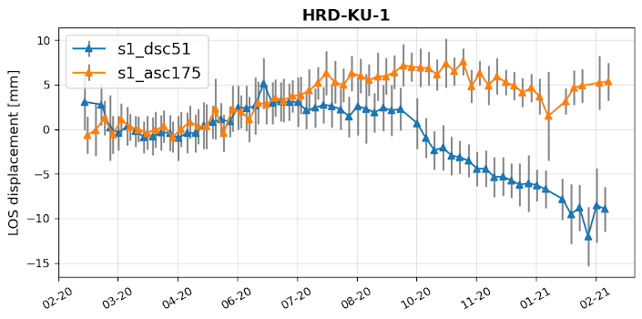

## InSAR module

GECORIS InSAR module does conventional multi-temporal InSAR analysis inspired by the geodetic estimation theory of TU Delft.

The analysis is performed in a network of corner reflectors plus surrounding coherent point scatterers (PS).

The prerequisite is the co-registered SAR image stack, see [data preparation module.](./)


Stand-alone time series InSAR module:

```python
python gecoris/insar.py insar.parms
```

Example of full InSAR parameters file `insar.parms` per single stack:

```python
{
  'stackDir': '/data/GUDS/CR_Prievidza/DSC51/',
  'stackId': 's1_dsc51',
  'subswath': 'IW3',
  'outDir': '/data/GUDS/CR_Prievidza/gecoris/insar/',
  'min_lat': 48.705,
  'max_lat': 48.813,
  'min_lon': 18.604,
  'max_lon': 18.734,
  'aver_h': 465.0,
  # parameters:
  'D_A_thr' : 0.25,       # Norm. Amplitude Dispersion (NAD) threshold on PS sel.
  'model' : 'seasonal',   # func. model to solve ambiguities, 'linear' / 'seasonal'
  'reference' : 'auto',   # 'auto' / 'free' / 'contraint' (single CR)
  'APS_flag' : 1,         # 0/1 = estimate and remove Atmospheric Phase Screen (APS)
  'plot_flag': 1,         # plots, 0 = none, 1 = sparse, 2 = detailed
}
```


It is recommended to perform [reflectivity analysis](./Reflector_monitoring_module.md) of corner reflectors first.

Then, parameters are automatically parsed from `gecoris.parms` and analysis is performed for all available stacks using:

```python
python gecoris/CR_insar.py gecoris.parms
```

**Default parameters with datum-free network solution are used.*


All data and results of InSAR processing are sequentially stored in a binary [HDF5](https://www.hdfgroup.org/solutions/hdf5/) format. Results are also converted into a human-readable CSV format.


### Example outputs

Displacement time-series plots for reflector:



Displacement time series of all reflectors in network (plus decomposed to vertical and horizontal):

