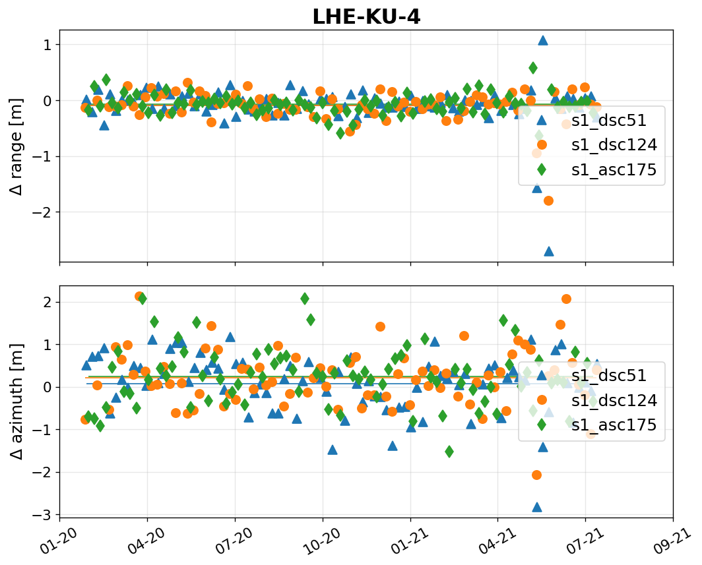

.. _reflector_monitoring:

********************
Reflector monitoring
********************

This module performs measurement extraction for all reflectors in a network, computes Absolute Positioning Errors (APE), Radar Cross Section (RCS), Signal-to-Clutter Ratio (SCR) and generates reports and plots.

This module assumes you have already prepared SLC stacks of your AOI using SNAP, see :ref:`snap_processing`.

The analysis runs automatically on the network-specific station log-files prepared by user in ``.json`` format.

.. note::

   Co-registration is not needed for operational monitoring of the reflectivity and positioning accuracy. 
   Analysis runs on the ``slaves`` directory.

Station log-files
-----------------

Template station log-files:

- :download:`reflectors.json <../templates/reflectors.json>`
- :download:`stacks.json <../templates/stacks.json>`

.. note::

   Contents of ``reflectors.json`` and ``stacks.json`` can be merged into a single file.

For networks containing many reflectors, ``csv`` input format can be used instead:

- :download:`reflectors.csv <../templates/reflectors.csv>`
- :download:`stacks.csv <../templates/stacks.csv>`

The geometry parameters of corner reflectors are explained in :ref:`cr_geometry_def`.

Time series analysis
--------------------

Prepare input parameters file :download:`gecoris.parms <../templates/gecoris.parms>`:

.. code:: python

   {
   "project" : 'PEM2',
   "stationLog" : '/home/rc/CR_Partizanske/reflectors.json',
   "stackLog" : '/home/rc/CR_Partizanske/stacks.json',
   "outDir" : '/home/rc/CR_Partizanske/gecoris/',
   "precisePosFlag" : 1,           # 0 = approx. / 1 = precise positioning
   "plotFlag" : 1,                 # 0 = no plots / 1 = sparse plots / 2 = detailed plots
   "atmoFlag" : 0,	                # 0 / 1 = use external models for atmo. delay correction
   "ovsFactor" : 32                # FFT oversampling factor
   }

Reflector class capabilites
---------------------------

Once you run the time series analysis, all extracted data are stored in instances of ``Reflector`` class.
Each instance contains list of stacks (``reflector.stacks``).

Let's find the index of a specific stack and look at its data:

.. code:: python

   reflectors[0].getStackIdx('s1_dsc51')

.. code::
 
   >> 0

.. code:: python

   reflectors[0].stacks[0]['data']

Now print the stats for this stack:
   
.. code:: python

   reflectors[0].getStackStats('s1_dsc51')

Or just print all time series for all the stacks:

.. code:: python

   reflectors[0].get_all_timeseries()

Making plots and reports
------------------------

Single reflector
****************

First, let's plot the radar cross section (RCS) time series of single reflector:

.. code:: python

   reflectors[0].plotRCS()

Similarly, one can plot the absolute positioning errors (APE) time series:

.. code:: python

   reflectors[0].plotALE_TS()

Now we export the stats to JSON:

.. code:: python

   reflectors[0].statsToJSON('/data/output/')

``/data/output/LHE-KU-4_stats.json``:

.. code:: json

   {
     "s1_dsc51": {
       "reflRCS": 32.81868591234495,
       "SCR": 23.70038818940449,
       "sigRCS": 0.3148330657079924,
       "clutRCSbefore": 9.500978820219451,
       "clutRCSafter": 9.118297722940458,
       "sigPhi_DA": 0.00020351132022353085,
       "sigPhi_SCR": 0.00020383591011901035,
       "azimuthCRB": 0.5527594433637688,
       "rangeCRB": 0.08936829323845362,
       "azimuthSTD": 0.6778552357079567,
       "rangeSTD": 0.38369251256879244,
       "azimuthALE": 0.06533686251683654,
       "rangeALE": -0.08902981820298544,
       "RCS0": 33.44776029342321
     },
     "s1_dsc124": {
       "reflRCS": 33.2221641710527,
       "SCR": 23.32817882820653,
       "sigRCS": 0.32864918848519836,
       "clutRCSbefore": 10.043578676576876,
       "clutRCSafter": 9.893985342846165,
       "sigPhi_DA": 0.0002123896783475315,
       "sigPhi_SCR": 0.00021276057965773464,
       "azimuthCRB": 0.5782900320352186,
       "rangeCRB": 0.0698944294233743,
       "azimuthSTD": 0.6762300255906063,
       "rangeSTD": 0.2803157149530284,
       "azimuthALE": 0.2052737931180985,
       "rangeALE": -0.09605003170513007,
       "RCS0": 33.126594819812844
     },
     "s1_asc175": {
       "reflRCS": 33.21045649400904,
       "SCR": 23.49841920818314,
       "sigRCS": 0.3222575243995891,
       "clutRCSbefore": 8.437444160018636,
       "clutRCSafter": 9.712037285825897,
       "sigPhi_DA": 0.00020828326339198585,
       "sigPhi_SCR": 0.00020863114707974089,
       "azimuthCRB": 0.5704539057674874,
       "rangeCRB": 0.08052547139431412,
       "azimuthSTD": 0.6772918998470858,
       "rangeSTD": 0.18446497948817264,
       "azimuthALE": 0.23605451279970796,
       "rangeALE": -0.07616969436924195,
       "RCS0": 33.56157353616145
     }
   }

Reflector network
*****************

Having a network of reflectors, one can make overall plots using ``gecoris.plotUtils``:

.. code:: python

   from gecoris import plotUtils
   
   plotUtils.plotNetworkALE(stations, 'network_ALE.png')
   plotUtils.plotNetworkRCS(stations, 'network_RCS.png')
   plotUtils.plotNetworkSCR_hz(stations, 'network_SCR.png')

    

    

