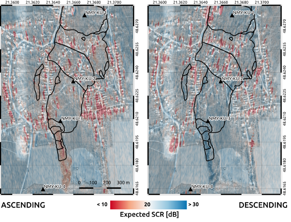

### Reflector planning module (SCR prediction)

Module to perform Signal-to-Clutter ratio (SCR) prediction over candidate site for reflector installation. 

First, prepare `coreg` stacks using [data preparation module](./Data_preparation_module). 

SCR prediction is done in a crop around specified geodetic coordinates. It is driven by input in [*planning.json*](./templates/planning.json):

```json
{
  "id": "PEM2",
  "longitude": 18.340544,
  "latitude": 48.630174,
  "elevation": 250.952,
  "cropSize": 200,
  "RCS": 30,
  "stackDir": "/data/CR_Partizanske/DSC124/",
  "oversamplingFactor": 16,
  "outTiff": "/data/CR_Partizanske/SCR/SCR_DSC124.tiff"
}
```

**`cropSize` is in [metres]*

** *`RCS` is expected reflector RCS in [dBm2]. Expected RCS of chosen reflector type can be simulated using tools in `crUtils` module.*


Run main function:

```bash
python gecoris/scrSimul.py planning.json
```

Result is a GeoTIFF with predicted SCR over AOI, see Example outputs.


### Example outputs

Maps of predicted SCR, given 1 m inner-leg-length square trihedral reflector (30 dBm2 RCS), computed on the 1-year of Sentinel-1 time series over specific landslide area in Slovakia:

