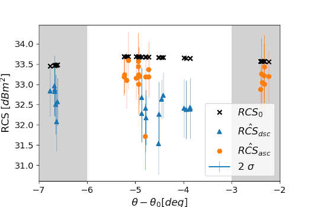

### Reflector (network) monitoring module

This module performs measurement extraction for all reflectors in a network, analyses their Absolute Positioning Errors (APE), Radar Cross Section (RCS), Signal-to-Clutter Ratio (SCR) and generates reports and various plots. 

Analysis runs automatically on the network-specific station log-files prepared by user in `json` format:

First, prepare Sentinel-1 data using [data preparation module](./Data_preparation_module). Note that co-registration is not needed.


#### 1. Prepare input files

Reflectors log file and stacks log file:

[*reflectors.json*](./templates/reflectors.json)

[*stacks.json*](./templates/stacks.json)

Example:

```json
{
"stations": [
{
  "id": "PEM2",
  "type": "CREF",
  "installDate": "20190716T1200Z",
  "startDate": "20190731T1200Z",
  "endDate": "99999999T9999Z",
  "ascending": {
    "orientation": true,
    "band" : "*",
    "coordinates": {
      "longitude": 18.340544487213673,
      "latitude": 48.630174139477305,
      "elevation": 250.95197,
      "CRS": "ETRS-89",
      "FRAME": "ETRF2000",
      "EPOCH": "2010.0",
      "EPSG": "4258"
      },
    "RCS0": null
    },
  "descending": {
    "orientation": true,
    "band" : "*",
    "coordinates": {
      "longitude": 18.340544487213673,
      "latitude": 48.630174139477305,
      "elevation": 250.95197,
      "CRS": "ETRS-89",
      "FRAME": "ETRF2000",
      "EPOCH": "2010.0",
      "EPSG": "4258"
      },
    "RCS0": null
    },
  "geometry": {
    "shape": "squareflipped",
    "flipped": true,
    "leglength": 0.76,
    "azimuthDip": 0.0,
    "zenithDip": 0.0
    },
  "RCS0": null
  }
],
"stacks": [
{
  "id": "s1_dsc124",
  "dataPath": "/home/rc/CR_Partizanske/new/DSC124/",
  "sensor": "Sentinel-1",
  "subswath": "IW1",
  "type": "raw"
  }
]
}
```

**For networks consisting of many reflectors, `csv` input format can be used instead, see [reflectors.csv](./templates/reflectors.csv) and [stacks.csv](./templates/stacks.csv).*


#### 2. Perform reflector analysis 

Prepare input parameters file (template in [*gecoris.parms*](./templates/gecoris.parms)):

Example:

```python
{
"project" : 'PEM2',
"stationLog" : '/home/rc/CR_Partizanske/reflectors.json',
"stackLog" : '/home/rc/CR_Partizanske/stacks.json',
"outDir" : '/home/rc/CR_Partizanske/gecoris/',
"precisePosFlag" : 1,           # 0 = approx. / 1 = precise positioning
"plotFlag" : 1,                 # 0 = no plots / 1 = sparse plots / 2 = detailed plots
"atmoFlag" : 0,	                # 0 / 1 = use external models for atmo. delay correction
"ovsFactor" : 32                # FFT oversampling factor
}
```

Perform time series analysis by running main function:

```bash
python gecoris/main.py gecoris.parms
```


### Example outputs

- [JSON exchange file](./examples/LHE-KU-1.json) with measurement time series per all stacks per each reflector

- Absolute Positioning Errors (APE) of the reflector:

   

- RCS time series of the reflector:

  

- Network plots with APE, RCS and SCR of all reflectors:




